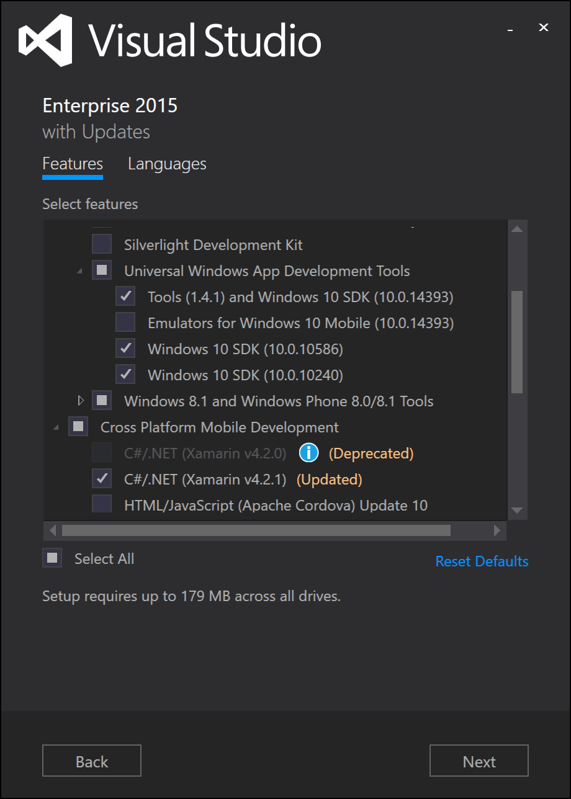

# Setting up
Actually, the setup of a working Xamarin environment might get a little bit tricky and time consuming as so many different SDKs and technologies have to intertwine.

## Install Xamarin
Installing Xamarin should be easy but the process varies on the different platforms.

On **Windows**, Xamarin gets installed with Visual Studio (including the free Community Edition). Either check the ***Xamarin*** checkbox in the installer or if Visual Studio is already installed, open the ***Programs and Features*** window, select ***Visual Studio*** and click <kbd>Change</kbd> to add new features.

On **Mac**, Xamarin needs to be installed seperately. [Download the installer](https://www.xamarin.com/download) and let it run. It should install all Xamarin components you might need, including the Android SDK and Xamarin Studio (now Visual Studio for Mac).

## Android
### Android SDK
Both ways of installing Xamarin for Mac or Windows should install the Android SDK automatically. If anything goes wrong, you can also [download it from the Google Developer portal](https://developer.android.com/studio/index.html).

### Android Emulator
To test your apps on Android, you might need an Android Emulator. You can use any emulator you like. When using Windows, I recommend the [Visual Studio Android Emulator](https://www.visualstudio.com/de/vs/msft-android-emulator), on Mac, you will go fine with the one that comes with [Android Studio](https://developer.android.com/studio/index.html).

## iOS
### iOS SDK and Simulator
To work with iOS, you need a Mac (at least anywhere in your network) with [Xcode](https://itunes.apple.com/de/app/xcode/id497799835?mt=12) installed. By default, this will install the latest iOS SDK and several simulators. You have to start Xcode at least once shortly, to initialize everything.

### Mac Build Host
When working on a Windows maching and using the Mac only as a Remote Build Host, you have to connect it with Visual Studio.

Click on <kbd>Tools</kbd> <kbd>Options...</kbd>, scroll down to the ***Xamarin*** section and click on ***iOS Settings*** to navigate to the configuration window. Here you can click on <kbd>Find Xamarin Mac Agent</kbd> to conenct you Mac. Follow the steps from the wizard to establish the connection.

Here you can also select, if you want to use the *Remote iOS Simulator* on Windows. If you select this checkbox, the iOS Simulator from the Mac will be streamed to your Windows machine and you can test your app there.

## Windows
### UWP SDK and Emulators
The Windows 10 (UWP) SDK has also be installed with Visual Studio. If you have not selected it while installing Visual Studio, follow the same process as above. Open the ***Programs and Features*** window, select ***Visual Studio*** and click <kbd>Change</kbd> to add new features.

Here you can select the ***Universal Windows App Development Tools* you want to install as well as Emulators for mobile. Remember, that you don't mandatory need Windows 10 Mobile Emulators, as you can run the same app package also in Windows 10 itself.