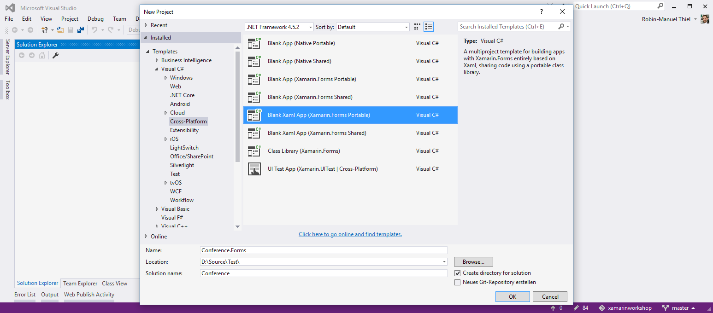
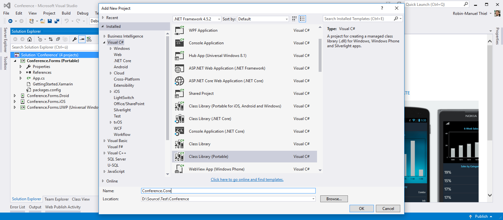
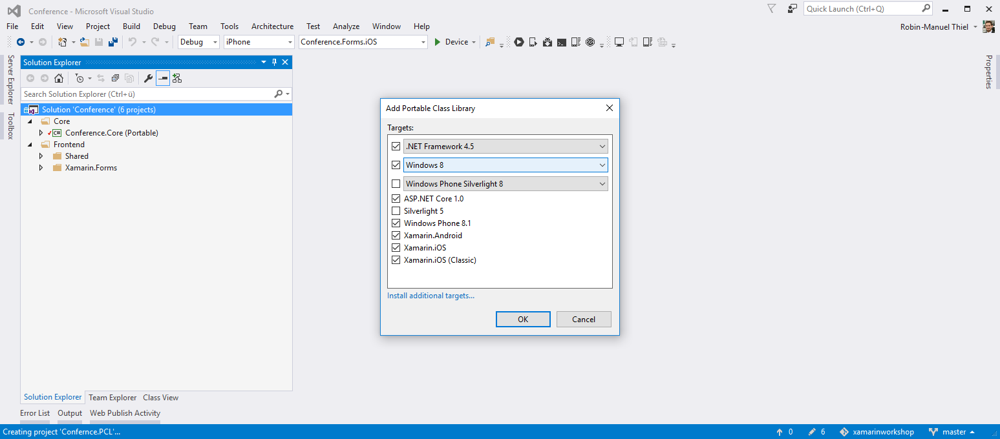
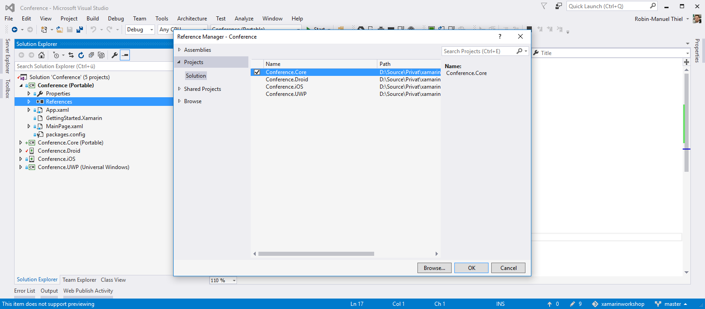
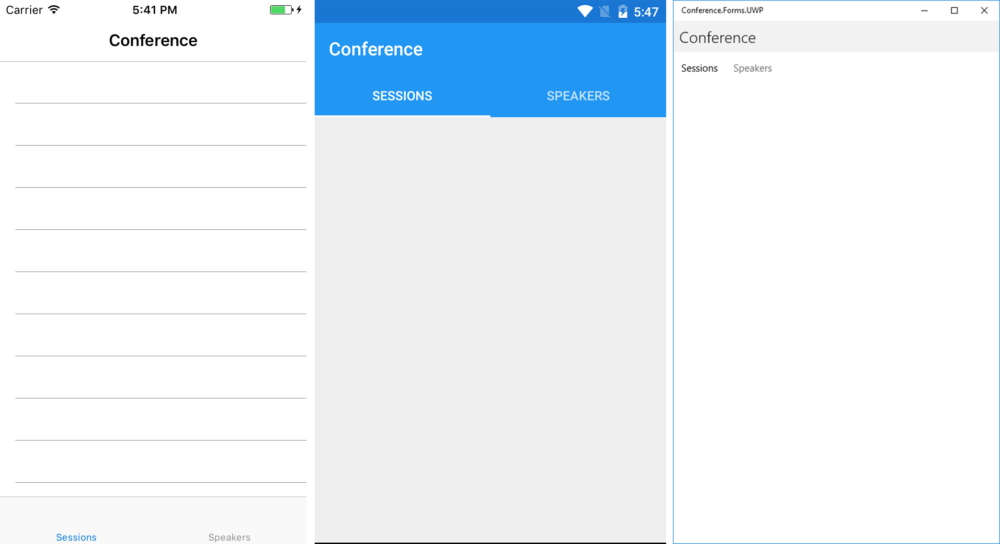
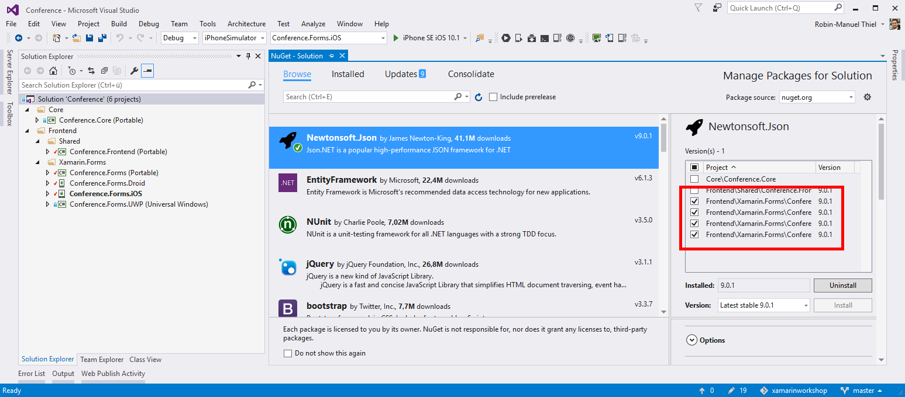
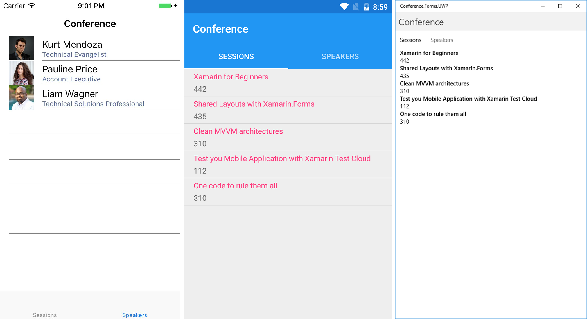

# Conference App with Xamarin.Forms
To dig deeper into the workflow of Xamarin development, we will create a real application in the next modules: A conference app. To keep UI work simple, we will use Xamarin.Forms for this to create the UI only once and share it across the other platforms. Please keep in mind, that Xamarin.Forms layouts are defined in XAML and will be rendered to **native** controls on each platform.

> **Hint:** If you got stuck during this module or lost the overview on where to place which code, you can always take the look at the [finished and working project](./Code) that is attached to this module.

We will create a conference app that will list all sessions with their speakers in separate tabs. Both, sessions and speakers will also have details pages that will be shown when the user tabs on an item. This results in having three views for the app:

- `MainPage` with two taps for sessions and speakers
- `SessionDetailsPage` with session details
- `SpeakerDetailsPage` with speaker details

## 1. Create the base structure
### 1.1 Create a new Xamarin.Forms solution
Creating a new Xamarin.Forms project is similar to creating a Xamarin Platform app as we already did before. In Visual Studio on Windows it's clicking <kbd>File</kbd> <kbd>New</kbd> <kbd>Project...</kbd>, navigating to the ***Cross-Platform*** section and selecting ***Blank Xaml App (Xamarin.Forms Portable)***. As we are creating a conference app here that uses Xamarin Forms. let's call the project "*Conference.Forms*" and the solution just "*Conference*".



### 1.2 Update NuGet packages
First, we have to check if we have the correct version of Xamarin.Forms in all our project. It is very important that the Xamarin.Forms NuGet packages are on the same version in each project. Unfortunately, this is not always the case when creating a fresh project.

In Visual Studio for Windows, we can right-click the solution name and select <kbd>Manage NuGet Packages for Solution...</kbd>, on Mac we have to do this manually for each project. Check, that the ***Xamarin.Forms*** package is on the same version on *every* project. The version I am working with in this workshop is `2.3.3.175` but newer versions should work, too.

> **Important:** When working with Xamarin.Forms. **do not update the Xamarin.Android.Support packages** to the latest version manually! Often, the latest Xamarin.Forms version is not automatically compatible with the latest Android Support Libraries.

### 1.3 Inspect the project structure
Let's inspect the Portable Class Library *Conference.Forms*, as this will be our main workplace. As we can see, there have also been iOS, Android and Windows projects for us but they are all linked to the shared project and only have to be touched when we want to implement platform specific features.

The `App.xaml` and its according `App.xaml.cs` file are the main entry point for our Xamarin.Forms app. While the XAML file only defines application wide resources, the `App.xaml.cs` file holds the application lifecycle methods and  kicks off the Xamarin.Forms framework and your UI. The first thing, Xamarin.Forms does here is setting the entry point to a new instance of the `MainPage` class whose logic and layout we can also find in the shared project.

```csharp
MainPage = new Conference.MainPage();
```

As we are working with multiple views later, it is a good idea, to set up a `NavigationPage` container which is one of the [Xamarin.Forms pre-defined page containers](https://developer.xamarin.com/guides/xamarin-forms/controls/pages) that allows navigation between multiple pages and set its initial UI to the `MainPage` instance.

```csharp
public App()
{
    InitializeComponent();

    var content = new Conference.MainPage();
    MainPage = new NavigationPage(content);
}
```

## 2. Create the models
Now it's time to give thought to the models that we want to use. Actually, our conference should deal with two types of objects: **Speakers** and **Sessions**. So let's create a model class for each. Before, let's take a second and think about where to place them. In a cross-platform scenario and in general in every cleanly separated code project we should also be aware of what's the best project to put a new function, class or service in!

As the models we want to create do not have any platform specifics and are not used in a specific scenario only, we should definitely put them into a new project that holds everything we want to span across multiple usage scenarios. For this, let's create a new ***Portable Class Library*** by right-clicking on the Solution in Visual Studio an selecting <kbd>Add</kbd> <kbd>New Project...</kbd>. In the ***Visual C#*** section, we will find the ***Class Library (Portable)*** project template. Let's call it ***Conference.Core*** and add it to our solution.



At this point, we should take a short digression on Portable Class Libraries (PCL). In .NET, these are projects that combine a subset of APIs and Types and offer the developer to use these across multiple projects. Inside the settings of Portable Class Libaries, we can choose which platforms, we want to target and the library will offer all of the overlapping APIs.

> **Hint:** In case you are more advanced and wondering: Yes, Xamarin does support [.NET Standard](https://blogs.msdn.microsoft.com/dotnet/2016/09/26/introducing-net-standard/) and you can also switch the PCLs to it, if you like. Currently this sometimes might cause some problems, which is why we avoid it in this workshop.

We can choose a wide range of APIs for our PCLs to make it compatible with as many other .NET platforms as possible.



Now we can finally create the classes for the **Speakers** and **Sessions** models.

```csharp
public class Speaker
{
    public string Id { get; set; }
    public string Name { get; set; }
    public string Title { get; set; }
    public string Bio { get; set; }
    public string Email { get; set; }
    public string ImagePath { get; set; }
}
```

```csharp
public class Session
{
    public string Id { get; set; }
    public string Name { get; set; }
    public string Room { get; set; }
    public DateTime StartTime { get; set; }
}
```

The last thing, we need to do is connecting the Portable Class Library with our Xamarin.Forms project. For this, just right-click the ***References*** folder and select <kbd>Add Reference...</kbd>. A new Windows opens that allows to manage project references. In the ***Projects*** tab, we find the recently created ***Conference.Core*** project and can add it to the Xamarin.Forms project by simply checking the box next to it.



## 3. Create the ViewModels
It's a common approach to use the Mode-View-ViewModel pattern (short: MVVM) in Xamarin.Forms and so will we do. This pattern enables us to have very clean layers, which allows us to build our application open for extensions and have a nice separation of code when it comes to sharing and reusability.

> **Hint:** One of MVVM's main characteristics is the *ViewModel*, which provides logic for the *View* without knowing the *View* itself. It basically is, what the *Contoller* does in other design patterns but can be reused in multiple Frontend projects, because it does not know anything about the View itself and only provides *Properties* and *Commands* (methods) that can be bound to the *View* later. This connection is called *Binding*. More information about MVVM can be found at the [MSDN library](https://msdn.microsoft.com/en-us/library/hh848246.aspx) or [Codeproject](http://www.codeproject.com/Articles/100175/Model-View-ViewModel-MVVM-Explained).

As we can use the ViewModel not only for our Xamarin.Forms project but also for other Frontend solutions that are based on MVVM later, it's good practice, to separate the ViewModel from the Xamarin.Forms project. Please be aware that it does **not** belong to our *Conference.Portable* project, as this should only contain those parts of our application that could be shared with *any other* layer (event with the backend). So let's keep it clean and create another ***Portable Class Library*** just as we did in the previous section and call it "*Conference.Frontend*".

### 3.1 Create a ViewModel that implements INotifyPropertyChanged
Now we can create our ViewModel in the new project. Add a new class and name it `MainViewModel` as it should provide the properties and commands for our `MainPage`. The first thing we need to to, to make our new class to a ViewModel is implementing `INotifyPropertyChanged`. This is important for data binding in MVVM Frameworks and is an interface that, when implemented, lets our view know about changes to the model. Just copy the following lines to your class to have a `OnPropertyChanged()` method, that will notify the View about changes, whenever it gets called.

```csharp
public class MainViewModel : INotifyPropertyChanged
{
    // Implementation of INotifyPropertyChanged
    public event PropertyChangedEventHandler PropertyChanged;
    private void OnPropertyChanged([CallerMemberName] string name = null) => PropertyChanged?.Invoke(this, new PropertyChangedEventArgs(name));
}
```

### 3.2 Add a busy indicator
It's a good practise to provide a busy indicator to the view so that it can show  this information to the user. So, let's add a property to our ViewModel that indicates, if we are currently calculating or downloading stuff.

```csharp
private bool isBusy;
public bool IsBusy
{
    get { return isBusy; }
    set { isBusy = value; OnPropertyChanged(); }
}
```

As you can see, we call `OnPropertyChanged()` in the setter to inform the View whenever the `IsBusy` property changes.

### 3.3 Create lists for Speakers and Sessions
We also need to add two lists that the view can use for displaying speakers and sessions to the user. For these, we should use the `ObservableCollection` class that is an implementation of `List` that notifies the view not only when it got set but also when its children changed.

```csharp
private ObservableCollection<Speaker> _Speakers;
public ObservableCollection<Speaker> Speakers
{
    get { return _Speakers; }
    set { _Speakers = value; OnPropertyChanged(); }
}

private ObservableCollection<Session> _Sessions;
public ObservableCollection<Session> Sessions
{
    get { return _Sessions; }
    set { _Sessions = value; OnPropertyChanged(); }
}
```

This is everything we need to provide bindable properties to our `MainPage` for now. So let's move on and create ViewModels for the other views we have.

### 3.4 Create the other ViewModels
The ViewModels for `SessionDetailsPage` and `SpeakerDetailsPage` look similar but are much simpler as they only have to provide the selected speaker or session.

1. Create two new classes and name them `SessionDetailsViewModel` and `SpeakerDetailsViewModel`
1. Implement the `INotifyPropertyChanged` interface as we did it in the `MainViewModel` above
1. Copy the `PropertyChanged` event and `OnPropertyChanged` method from the `MainViewModel` to the new ViewModels
1. Add a bindable property for `CurrentSession` and `CurrentSpeaker` to the according ViewModels
```csharp
private Speaker currentSpeaker;
public Speaker CurrentSpeaker
{
    get { return currentSpeaker; }
    set { currentSpeaker = value; OnPropertyChanged(); }
}
```
```csharp
private Session currentSession;
public Session CurrentSession
{
    get { return currentSession; }
    set { currentSession = value; OnPropertyChanged(); }
}
```

That's it. Now we have three ViewModels, one for each view that we can bind to the UI that we will create in the next step.

## 4. Create the MainPage
Finally, we can start creating the UI. As we remember from the start, we want to create three views for our application that we created ViewModels for. Let's begin creating MainPage and bind its UI to the ViewModel properties!

### 4.1 Create the tabs
When taking a look at the `MainPage.xaml` file, we can see, that Xamarin.Forms created a new page of type `ContentPage` for us. As we want to create a page with multiple tabs, we need to change this to a `TabbedPage`, which is a [pre-defined Xamarin.Forms Layout](https://developer.xamarin.com/guides/xamarin-forms/controls/layouts/). The tabs get defined by creating two `ContentPage`s inside which will contain the content of our session and speaker tabs.

```xml
<TabbedPage
    xmlns="http://xamarin.com/schemas/2014/forms"
    xmlns:x="http://schemas.microsoft.com/winfx/2009/xaml"
    xmlns:local="clr-namespace:Conference"
    x:Class="Conference.Forms.MainPage"
    Title="Conference">

    <ContentPage Title="Sessions">
        <!-- Sessions Tab -->
    </ContentPage>

    <ContentPage Title="Speakers">
        <!-- Speakers Tab -->
    </ContentPage>
</TabbedPage>
```

Please notice, that we also added a `Title="Conference"` property to the `TabbedPage` root element to give the whole container a header. As we changed the page from a `ContentPage` to a `TabbedPage`, we also have to change this in the `MainPage.xaml.cs` code behind file.

```csharp
public partial class MainPage : TabbedPage
{
    // ...
}
```

### 4.2 Binding Context
Here we can also set the `BindingContext` of the page. It defines against which classes properties we can bind UI components to. As we are creating the `MainPage` here, the `BindingContext` should point to an instance of `MainViewModel`. Let's save the `MainViewModel` instance as a private field just in case we need to access it later.

```csharp
public partial class MainPage : TabbedPage
{
    private MainViewModel viewModel;

    public MainPage()
    {
        InitializeComponent();
        viewModel = new MainViewModel();
        BindingContext = viewModel;
    }
}
```

Now we can bind the MainPages's UI elements to the ViewModel's properties. Also, the view now gets informed, whenever something in the ViewModel changes, because of the `INotifyPropertyChanged` implementation.

### 4.3 Session and Speaker Lists
Let's get back to the layout inside the `MainPage.xaml.cs` file and create the lists for sessions and speakers. In Xamarin.Forms lists are described with the `ListView` class. It has a property called `ItemsSource` which defines from which source it should display items and that is bindable. So we can bind it directly to the ViewModel.

```xml
<!-- Sessions Tab -->
<ContentPage Title="Sessions">
    <ListView ItemsSource="{Binding Sessions}" />
</ContentPage>
```

Inside the `ListView` we can also define, how a displayed item should look like. This has to be defined in the `ListView.ItemTemplate` property and can be any view. Everything, we create inside this template can also be bound to a single the current context.

> **Hint:** Every element in XAML has its own Binding Context. Inside a `ListView.ItemTemplate`, this context differs from the `ListView` itself. While it has the page's context (a `MainViewModel` in this case), it gives a single instance of its `ItemsSource` to its children. This means `ListView.ItemTemplate` has a single item as its Binding Context.

We could either define our own item layout here or chose one of the [predefined Xamarin.Forms Cells](https://developer.xamarin.com/guides/xamarin-forms/controls/cells/). The [Text Cell](https://developer.xamarin.com/api/type/Xamarin.Forms.TextCell/) looks like something we can use. It offers a primary and secondary text, which fits perfectly for the session list and can be bound to the `Name` and `Room` properties that we implemented in our `Session` model.

```xml
<!-- Sessions Tab -->
<ContentPage Title="Sessions">
    <ListView ItemsSource="{Binding Sessions}">
        <ListView.ItemTemplate>
            <DataTemplate>
                <TextCell 
                    Text="{Binding Name}"
                    Detail="{Binding Room}" />
            </DataTemplate>
        </ListView.ItemTemplate>
    </ListView>
</ContentPage>
```

The same can be used for the list of speakers, that we want to show in the second tab. Here we could use the predefined [Image Cell](https://developer.xamarin.com/api/type/Xamarin.Forms.ImageCell/), which is a Text Cell with a little image next to it, where we could show the speaker image that can be found in the `ImagePath` property of our `Speaker` class. Notice, that we just need to provide a URL to the Image Cell. Xamarin Forms handles the download and caching automatically for us.

```xml
<!-- Speakers Tab -->
<ContentPage Title="Speakers">
    <ListView ItemsSource="{Binding Speakers}">
        <ListView.ItemTemplate>
            <DataTemplate>
                <ImageCell
                    Text="{Binding Name}" 
                    Detail="{Binding Title}" 
                    ImageSource="{Binding ImagePath}" />
            </DataTemplate>
        </ListView.ItemTemplate>
    </ListView>
</ContentPage>
```

And that's it, we created the MainPage. We should try it out and run the application! Right-click on the platform projects for iOS, Android and Windows that you want to test your app on and select <kbd>Set as StartUp Project</kbd>. Now run your application.



Looks good, but pretty empty, mh? That's because we don't have any data to display yet. Let's move over to the next section and change that!

## 5. Get the data
Communicating with a potential Backend or managing data is something that is not platform or Xamarin.Forms specific, so let's get back to the shared *Conference.Forms* project where our ViewModels are located. Here we can implement our data management logic.

### 5.1 Creating the Conference Service
To keep the code separation clean, we should create a new service class that handles data for us. Let's imagine, we had a Conference Server that manages sessions and speakers somewhere in the cloud that we can connect to.

As we might be creating different ways of getting data later (we will be using the cloud in the next modules), we should create an `IConferenceService` interface, that defines, how a conference data provider should look like.

```csharp
public interface IConferenceService
{
    Task<List<Session>> GetSessionsAsync();
    Task<List<Speaker>> GetSpeakersAsync();
}
```

This is quite simple and just defines, that we are expecting two asynchronous methods from a service, that implements this interface: One for providing a list of speakers and one for the sessions.

For the moment, we are good with simple HTTP calls and can create a new class called `HttpConferenceService`, wich implements the `IConferenceService` interface in the Frontend project. Inside, we should define two async methods that return a list of speakers and sessions and call them `GetSessionsAsync` and `GetSpeakersAsync`. We define these classes as asynchronous, because we don't know how long the server connection might take. To not block the UI thread, we can run them on a separate thread easily by defining them as `async`.

> **Hint:** In C#, you can easily let methods run on a separate thread by defining their execution asynchronously with the `async` keyword. These methods have to return a `Task` or `Task<WithReturnType>` then. You can call the method using the `await` keyword.

```csharp
public class HttpConferenceService
{
    public async Task<List<Session>> GetSessionsAsync()
    {
        return new List<Session>();
    }

    public async Task<List<Speaker>> GetSpeakersAsync()
    {
        return new List<Speaker>();
    }
}
```

### 5.2 Talking to a webserver via HttpClient
As you can see, we are just returning empty lists at the moment so it is time to fill them. For this, we need to talk a web-server, which is where the `HttpClient` class comes into play. It offers the very simple to use `GetStringAsync(string)` method, that sends a GET-Request to an URL and returns its string-content.

Unfortunately, HTTP requests are handled individually on each platform which entails, that we can't use the `HttpClass` itself in our Portable Class Library. But what we can do, is creating an interface `IHttpService` that every platform has to implement by itself.

```csharp
public interface IHttpService
{
    Task<string> GetStringAsync(string url);
}
```

We can use this interface inside our `HttpConferenceService` and simply gives implement it on platform-level later.

> **Hint:** We used the concept of *Dependency Injection* here for the first time, which is fundamentally important for a clean platform independent architecture. The processing of the downloaded data can be done platform independently, so we should implement it here. The download itself has to be implemented for each platform, but we can split it here and make the platform provide an implementation of an interface that we use at runtime.

We can now use this interface in our `HttpConferenceService` and tell the constructor, that it needs and implementation of our `IHttpService` interface, when it gets instantiated.

```csharp
public class HttpConferenceService : IConferenceService
{
    private IHttpService httpService;

    public HttpConferenceService(IHttpService httpServiceImpl)
    {
        httpService = httpServiceImpl;
    }

    // ...
}
```

### 5.3 Download session and speaker information
We will be talking about backends in detail in the next module so let's just pretend we had a powerful backend here and mock the data. For this, I've prepared two JSON files for a list of demo sessions and speakers and [uploaded them to GitHub](). You can see, that they match the structure of our `Session` and `Speaker` classes.

As you will have noticed, the data is formatted in JSON, which is a common and widely spread standard for data exchange. We need a way to convert JSON to C# classes and vice versa so let's get some help from the community and add the great [Json.NET NuGet package](https://www.nuget.org/packages/newtonsoft.json/), which allows us to work with JSON easily. 

> **Important:** You need to add the Json.NET package to every project that uses it later: The Portable Class Library and the platform projects. When using Visual Studio on Windows, you can just right-click the Solution file and select <kbd>Manage NuGet Packages for Solution...</kbd>.



Now we can download the mocked Session and Speaker lists form the GitHub servers and convert them into instances of our C# classes easily.

```csharp
public async Task<List<Session>> GetSessionsAsync()
{
    var json = await httpService.GetStringAsync("https://raw.githubusercontent.com/robinmanuelthiel/xamarinworkshop/master/04%20Speaker%20App%20with%20Xamarin.Forms/Mock/mocksessions.json");
    var sessions = JsonConvert.DeserializeObject<List<Session>>(json);
    return sessions;
}
```

Let's do the same for our `GetSpeakersAsync()` method with the other JSON file and we can move over to filling the MainViewModel.

```csharp
public async Task<List<Speaker>> GetSpeakersAsync()
{
    var json = await httpService.GetStringAsync("https://raw.githubusercontent.com/robinmanuelthiel/xamarinworkshop/master/04%20Speaker%20App%20with%20Xamarin.Forms/Mock/mockspeakers.json");
    var speakers = JsonConvert.DeserializeObject<List<Speaker>>(json);
    return speakers;
}
```

### 5.4 Use the ConferenceService in the ViewModel
Now that we created methods that download the conference information from the (mocked) server and converts them to `List<Speaker>` and `List<Session>` we can move over to our `MainViewModel` to call them there.

For this, our ViewModel needs an instance of the `HttpConferenceService` of course. But there is a little problem: As the `HttpConferenceService` needs an implementation of `IHttpService` to get instantiated, we cannot to the instantiation inside the `MainViewModel`. It also lives in the Portable Class Library and does not (and should not) know, how HTTP requests works on the platforms.

To solve this, we use the same trick again, that we already used in the `HttpConferenceService` class: Dependency Injection. By claiming a `HttpConferenceService` implementaion in the ViewModel's constructor, someone else is responsible  for creating a `HttpConferenceService` and providing it to our ViewModel. Someone, who *has* knowledge of HTTP requests: The platform itself. Our dependency chain grows!

```csharp
public class MainViewModel : INotifyPropertyChanged
{
    private IConferenceService conferenceService;

    public MainViewModel(IConferenceService conferenceServiceImpl)
    {
        conferenceService = conferenceServiceImpl;
    }

    // ...
}
```

There is no problem with that. On the contrary, this is good and clean. Remember, who is instantiating  the `MainViewModel`! Right, it is the view. It's our `MainPage.xaml.cs` file that calls `viewModel = new MainViewModel();` in its constructor. The MainPage lives inside the Xamarin.Forms project so it has platform knowledge and can implement `IHttpService` easily.

> **Hint:** Sorry for taking so much time for *Dependency Injection* but this is the hardest part to understand. If you got this, you can master incredibly clean and nested architectures easily and reuse your code like you have never imagined!

Back to the ViewModel. As it can make use of the `Conference` service now, we should create a short and simple `RefreshAsync()` method, that loads the data into the `ObservableCollection`s that get provided to the views.

```csharp
public async Task RefreshAsync()
{
    IsBusy = true;

    // Download
    var sessions = await conferenceService.GetSessionsAsync();
    var speakers = await conferenceService.GetSpeakersAsync();

    // Fill lists
    Sessions = new ObservableCollection<Session>(sessions);
    Speakers = new ObservableCollection<Speaker>(speakers);

    IsBusy = false;
}
```

### 5.5 Trigger the download from the view
Now we just have to get back to the `MainPage.xaml.cs` file and trigger our recently created `RefreshAsync` method whenever the MainPage got loaded. For this, we override the `OnAppearing` lifecycle method and attach out call to it.

```csharp
protected override async void OnAppearing()
{
    base.OnAppearing();
    await viewModel.RefreshAsync();
}
```

Actually, that is all we need to do. But you might have noticed, that our project does not build successfully anymore because the `MainViewModel` can not get instantiated with the default constructor anymore. So we need to serve the mechanisms of Dependency Injection.

### 5.6 Play the Dependency Injection game
Remember, that we created some dependencies, when creating our services.

1. The `HttpConferenceService` needs an implementaion of `IHttpService`
2. The `MainViewModel` needs an instance of `HttpConferenceService` which needs an implementation of `IHttpService`

To solve the first dependency, we should finally implement this `IHttpService` interface in our Xamarin.Forms project. So let's create a `FormsHttpService` class here.

To add the `HttpService` class to our project, we need to install the [Microsoft HTTP Client Libraries NuGet package](https://www.nuget.org/packages/Microsoft.Net.Http) to our project. Usually, we had to implement the interface into every platform project, but thanks to the community again, we can use the [ModernHttpClient NuGet package](https://www.nuget.org/packages/modernhttpclient/) to avoid this. So add them both to your Xamarin.Forms project and create the `FormsHttpService`. 

```csharp
using ModernHttpClient;
using System.Net.Http;

public class FormsHttpService : IHttpService
{
    private HttpClient httpClient;

    public FormsHttpService()
    {
        // Create a cross-plaform HttpClient for Xamarin
        httpClient = new HttpClient(new NativeMessageHandler());
    }

    public async Task<string> GetStringAsync(string url)
    {
        return await httpClient.GetStringAsync(url);
    }
}
```

Now that we have everything we need to build our Dependency Injection chain, we can go back to the `MainPage.xaml.cs` file and instanciate the `MainViewModel` with its dependencies.

```csharp
public MainPage()
{
    InitializeComponent();

    var httpService = new FormsHttpService();
    var conferenceService = new HttpConferenceService(httpService);
    viewModel = new MainViewModel(conferenceService);

    BindingContext = viewModel;
}
```

Everything can be instantiated  correctly now and we can run our application and finally download the data we need. So let's see how the application looks like on the different platforms!



> **Hint:** Please keep in mind, that we made everything dramatically more complicated than needed. Of course, we could have implemented everything insinde the Xamarin.Forms project without any need of Dependency Injection. But consider, that we can reuse the ViewModels and Services in **any other** .NET project! 

## 6. Create the Details Pages
Let's quickly create two new pages for the speaker and session details. The procedure is the same as we already did with the `MainPage`: Create the layout, bind it to the ViewModel and add it as Binding Context.

### 6.1 Create the views
We need two more pages to show details for speaker and session. Add them by right-clicking the Xamarin.Forms project, clicking on <kbd>Add</kbd> <kbd>New Item...</kbd> and selecting the ***Forms Xaml Page*** template. Let's name them `SpeakerDetailsPage` and `SessionDetailsPage`.

To keep the UI simple, we can just arrange a bunch of `Label`s vertically below each other in a `StackLayout` for the `SessionDetailsPage.xaml`.

```xml
<ContentPage 
    xmlns="http://xamarin.com/schemas/2014/forms"
    xmlns:x="http://schemas.microsoft.com/winfx/2009/xaml"
    x:Class="Conference.Forms.SessionDetailsPage"
    Title="Session">
    <ContentPage.Content>
        <StackLayout Padding="10">
            <Label Text="Name" FontAttributes="Bold" />
            <Label Text="{Binding CurrentSession.Name}" />
            <Label Text="Room" FontAttributes="Bold" />
            <Label Text="{Binding CurrentSession.Room}" />
            <Label Text="Start" FontAttributes="Bold" />
            <Label Text="{Binding CurrentSession.StartTime}" />
        </StackLayout>
    </ContentPage.Content>
</ContentPage>
```

Let's do the same for the `SpeakerDetailsPage.xaml` and add an additional picture for the speaker to it.

```xml
<ContentPage 
    xmlns="http://xamarin.com/schemas/2014/forms"
    xmlns:x="http://schemas.microsoft.com/winfx/2009/xaml"
    x:Class="Conference.Forms.SpeakerDetailsPage"
    Title="Speaker">
    <ContentPage.Content>
        <StackLayout Padding="10">
            <Image Source="{Binding CurrentSpeaker.ImagePath}" />
            <Label Text="Name" FontAttributes="Bold" />
            <Label Text="{Binding CurrentSpeaker.Name}" />
            <Label Text="Title" FontAttributes="Bold" />
            <Label Text="{Binding CurrentSpeaker.Title}" />
            <Label Text="Bio" FontAttributes="Bold" />
            <Label Text="{Binding CurrentSpeaker.Bio}" />
        </StackLayout>
    </ContentPage.Content>
</ContentPage>
```

### 6.2 Initialize the ViewModel
As you can see, we created views, that bind against the `CurrentSpeaker` and `CurrentSession` properties of their regarding view models. So let's kick them off. These procedure is the same for both pages, so we need to do it in both.

First, we create a ViewModel property in the code behind file, instantiate it and set is as the pages Binding Context.

```csharp
public partial class SessionDetailsPage : ContentPage
{
    private SessionDetailsViewModel viewModel;

    public SessionDetailsPage()
    {
        InitializeComponent();

        // Initialize the ViewModel
        viewModel = new SessionDetailsViewModel();

        // Set ViewModel as Binding Context
        BindingContext = viewModel;
    }
}
```

When the `SessionDetailsViewModel` gets instanciated, its `CurrentSession` property will be `null` by default. So it needs to get set to the currently selected session. As the `SessionDetailsPage` does not know this session yet, we have to provide this information, whenever navigating to it.

For this, add a `Session` property to the constructor of the page.

```csharp
public SessionDetailsPage(Session session)
{
    // ...

    viewModel = new SessionDetailsViewModel();
    viewModel.CurrentSession = session;

    // ...
}
```

Now we have to provide a session to the page when navigating to it. This session will be set as the `SessionDetailsViewModel`'s `CurrentSession` property.

### 6.3 Add Navigation
Nice, now we just have to navigate to the according details page, whenever a speaker or session got selected. For this, we should return to the `MainPage.xaml` and add an Event Handler to the `ItemSelected` event of the two `ListView`s.

```xml
<!-- Sessions Tab -->
<ContentPage Title="Sessions">
    <ListView
        ItemsSource="{Binding Sessions}"
        ItemSelected="Session_ItemSelected">
        <!-- ... -->
    </ListView>
</ContentPage>

<!-- Speakers Tab -->
<ContentPage Title="Speakers">
    <ListView 
        ItemsSource="{Binding Speakers}" 
        ItemSelected="Speaker_ItemSelected">
        <!-- ... -->
    </ListView>
</ContentPage>
```

Inside the `MainPage.xaml.cs` code behind file, we now have to implement these Event Handlers so that they can be called whenever the user selected an item.

```csharp
private void Session_ItemSelected(object sender, Xamarin.Forms.SelectedItemChangedEventArgs e)
{

}

private void Speaker_ItemSelected(object sender, Xamarin.Forms.SelectedItemChangedEventArgs e)
{

}
```

Inside, we have to find out, which item got selected and cast it to its correct type.

```csharp
private void Session_ItemSelected(object sender, Xamarin.Forms.SelectedItemChangedEventArgs e)
{
    // Get selected session
    var selectedSession = e.SelectedItem as Session;
    if (selectedSession != null)
    {
        // Navigate to details page and provide selected session
        // ...
    }
}
```

Navigation in Xamarin.Forms is easy, as the framework already provides a `Navigation` class to us that contains implementations for the navigation on each platform. We can use its `PushAsync(Page)` method to navigate to another page. This page has to be instantiated of course with ... correct, the selected item.

```csharp
// Navigate to details page and provide selected session
Navigation.PushAsync(new SessionDetailsPage(selectedSession));
```

After we handled the `ItemSelected` event, we should unselect the current item so that out `Session_ItemSelected` handler should now look like this:

```csharp
private void Session_ItemSelected(object sender, Xamarin.Forms.SelectedItemChangedEventArgs e)
{
    // Get selected session
    var selectedSession = e.SelectedItem as Session;
    if (selectedSession != null)
    {
        // Navigate to details page and provide selected session
        Navigation.PushAsync(new SessionDetailsPage(selectedSession));
    }

    // Unselect item
    (sender as ListView).SelectedItem = null;
}
```

Repeat this for the `Speaker_ItemSelected` handler as well and we are done. 

Congratulations, you have successfully created your first working Xamarin.Forms application!

## 7. Wrapping up what we have learned
Phew, what a ride! Let's take a breath and review what we have learned in this module.

As you might have noticed, structure is very important to me. I just want to prepare you for the future and we created many things here that can be shared across different projects. So let's take a look at what we build.

- Conference.Core
    - Contains Models and Serverices that are absolutely independent from its usage scenario
    - Can be shared with **every other** .NET project in our ecosystem. Server, Bot, Microservice or whatever
    - Changes affect every layer of our solution
- Conference.Frontend
    - Contains Frontend solution focused parts like ViewModels and Services
    - Can be shared with **every other** .NET frontend solution, not only Xamarin
    - Defines Interfaces that frontends have to implement
- Conference.Forms
    - Contains logic that can be shared with every platform supported by Xamarin.Forms (iOS, Android, Windows, ...)
    - Defines unified layouts and logic that gets rendered on each platform independently

As structure is so important, it might be a good idea to add Solution Folders. These can help you structuring multiple projects. Take a look at the [finished and working project](./Code) that you can find in this repository.