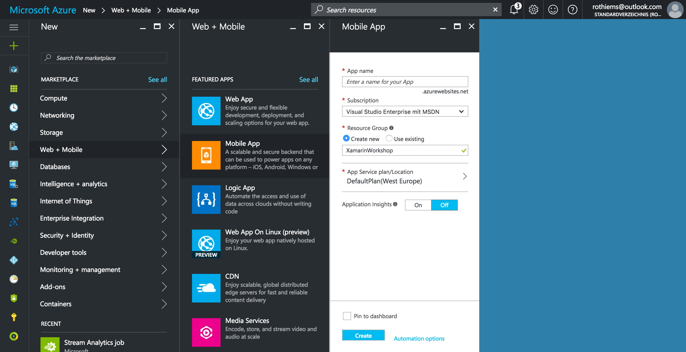
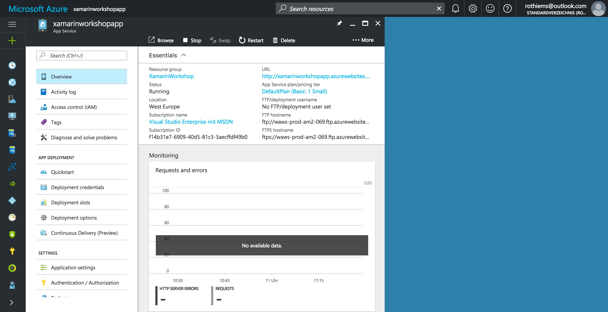
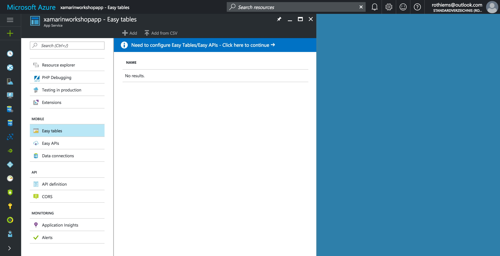
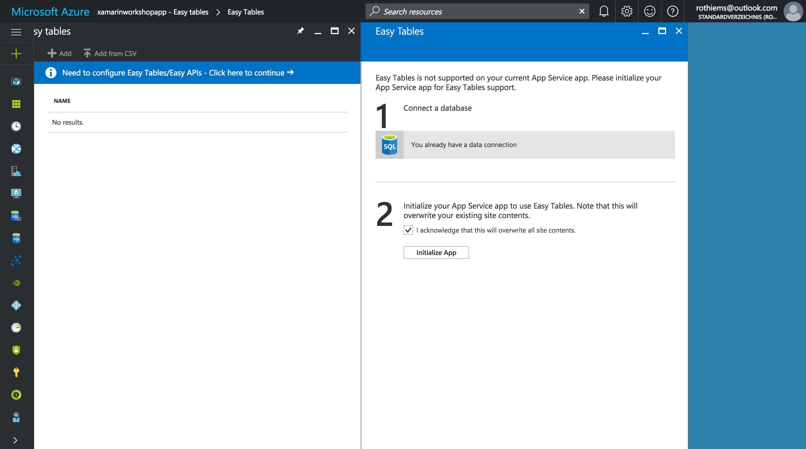
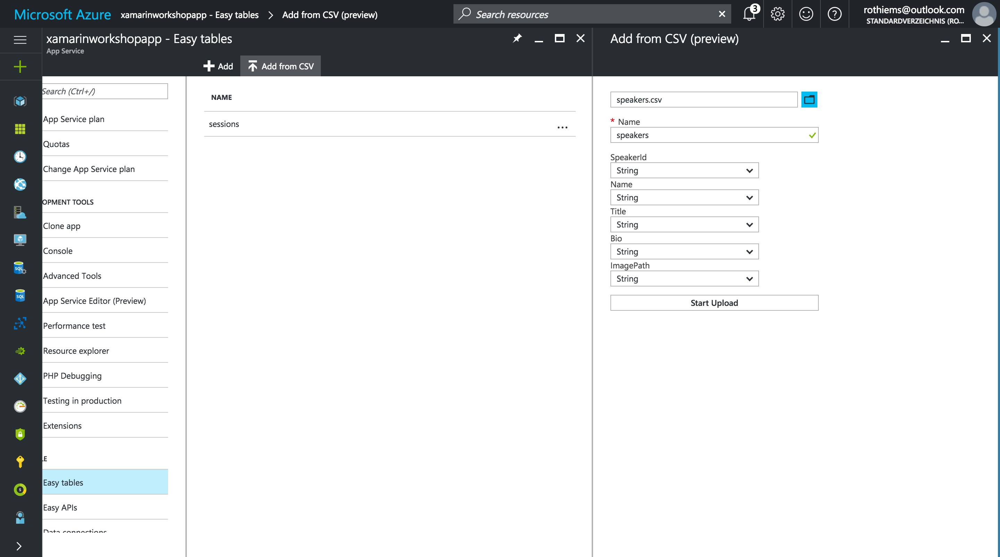

# Azure App Service Backend
Now it's time to create a suitable Backend for our Conference App. As Xamarin likes many different Backend providers like AWS, IBM or Google and also provide SDKs for them in the component store, [Microsoft Azure](https://www.azure.com) is the prefered choice for Xamarin Developers around the world.

Not least, because it's an easy way to start with and can get scaled up to a really powerful service easily with a few clicks, we will start with Microsoft Azure's App Services. They provide an easy to use pre-configured backend solution called ***Azure Mobile App*** that offers

- Easy Tables (Database)
- Easy APIs using .NET or Node.js
- Authentication (Active Directory and Social Login)
- Offline Synchronisation
- Push Notifications
- Easy Scalability

## 1. Create a Azure Mobile App
Mobile Apps are part of the Azure App Service offer and provide a Platform as a Service (PaaS) architecture to give developers an easy way to host applications without too much infrastructure management overhead.

To create a new Mobile App Resource, simply open the [Azure Portal](https://portal.azure.com) and login with your account.

> **Hint:** If you don't have an Azure Account, you can [create a free one](https://azure.microsoft.com/free/) and get $200 in credit for the first 30 days. You can keep going with free options afterwards.

Inside the portal click the ***New*** button and select the ***Web + Mobile*** category. Here you will find the ***Mobile App*** template, that we can configure now.

1. **Name:** The easiest part. Give your service a unique name
1. **Subscription:** Choose an Azure Subscription that is connected to your profile and that pays for the service
1. **Resource Group:** Choose an existing resource group or create a new one to deploy the App Services in. I always recommend a new one for a better overview about costs and services
1. **App Service Plan / Location:** The App Service Plan the is actual hardware that your Mobile App will run on. You can run multiple services on a single plan and scale the whole plan later. This also defines the location of your service. Either choose an existing App Service Plan you already have or create a new one.
1. **Application Insights:** Telemetry tracking. We can leave it off for now and switch it on later.

## 2. Mobile App overview
Once Azure created your Mobile App, you can open it's overview blade. This is the main entry point for your service.

On the left side, you can see the menu with all the settings you can adjust, the top pane shows basic information like the URL of your Mobile App (we will need that later) and the Status and Location. Blow, you can configure your personal dashboard with usage metrics.

## 3. Data connection with Easy Tables
One of the first things, we want to do when building the Backend for our Conference App is saving data. The Azure Mobile Apps provide a super easy way to work with simple data structures called ***Easy Tables***. To initialize these, we need to connect the App Service with a data storage.

Locate the ***Easy Tables*** entry at the side menu on the left and click on it. The according section opens and should offer you to configure Easy Tables / Easy APIs. Let's follow the steps to initialize a database connection.

First, we need a database to use Easy Tables. Click on the message to start the wizard. Here we have to define a database to store the data in and initialize the backend logic then on top of it.

### 3.1 Connect a database
In most cases it makes sense, to create a fresh new database for your App Service. To do this, follow these steps:

1. Click in grey database connection warning sign to open the ***Data Connections*** tab.
1. Click the ***Add*** button to configure a new connection
1. Select *SQL Database* as the Type and click the ***Configure required settings*** button
1. Create an new database and provide a ***Name***
1. Choose a pricing tier. B is cheap and sufficient for our purpose
1. Define the server your database should run on. If you don't have an existing server, create a new one and make sure, you *note the username and password*
1. Click ***Select*** to close the blade
1. Keep the ***Collation*** on "*SQL_Latin1_General_CP1_CI_AS*" and click ***Select***
1. Click on the ***Connection string*** button to open the according blade
1. Give it a name and confirm your selection with ***Ok***

Now you created a new SQL Database to store your data in. Regarding on your previous work on Azure you might also have created a database server. Keep in mind, that you can run multiple databases on one server later.

> **Hint:** The following is a little bit confusing in Azure currently: You have to wait some time, until Azure spins up the database and creates the connection string. Until this, it will still claim a data connection. You can click in the ***Notifications icon*** at the top bar to follow the process of creating. Just wait until it's done.

### 3.2 Initialize the Easy Tables
Once the connection has been established, you can start spinning up the Easy Tables. For this simply hit the ***Initialize App*** button and let Azure do the rest.

This will spin up a Node.js backend that is based on the Express.js framework that connects to the database and manages custom APIs and Easy Tables.

You can take a look at it and even edit the code online if you want to by selecting the ***App Service Editor*** in the side menu of your App Service.

## 4. Create the tables and fill them with data
Now we can start creating tables and pump our speakers and sessions data into it. In the ***Easy Tables*** section, we can now manage tables, their schemas and data. To keep things simple we will upload pre-defined tables that matches the data from the JSON files of the previous module.

For this, we click the ***Add from CSV*** button and select the [CSV files attached](./CSV) to this module.

This will create two databases for you that represent the structure of the CSV files plus some additional fields like a *GUID* and *CreatedAt* field and few more. We can explore the data by clicking on one of these tables.

Now that we have our backend up and runnung and filled with data, we can connect our frontend app with it.