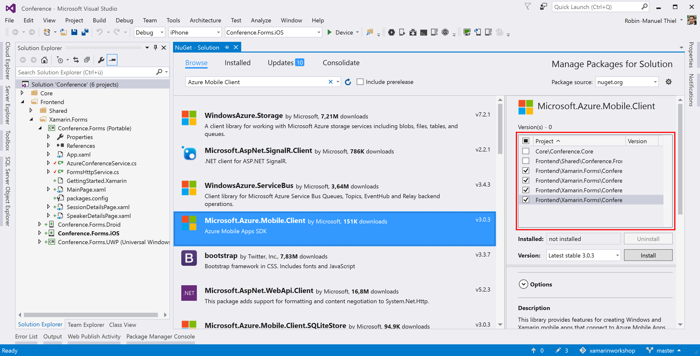

# Connecting to the cloud
For this, we need to get back to Visual Studio and open the application we created in the previous module.

> **Hint:** If you got stuck during this module or lost the overview on where to place which code, you can always take the look at the [finished and working project](./Code) that is attached to this module.

## 1. Create a new Conference Service with Azure
### 1.1 Adding the SDK packages
Every Azure resource is available via REST API calls, but SDKs make a developer's life a lot easier, which is why we should add the [Azure Mobile Client SDK NuGet package](https://www.nuget.org/packages/Microsoft.Azure.Mobile.Client/) to the project.

As the SDK use platform specific components like the SQLite database that is used for offline synchronization, the NuGet package has to be added to all projects that uses it.

- Xamarin.Forms project
- iOS project
- Android project
- Windows project

In Visual Studio for Windows, I can manage packages solution wide by right-clicking the solution inside the Solution Explorer, selecting <kbd>Manage NuGet Packages for Solution...</kbd>.



### 1.2 Initialize the Mobile Service
The Azure Mobile Service SDK has to initialized on each platform that uses it separately. We have already added the NuGet package, so we just have to kick it off on each platform.

```csharp
// Initialize Azure Mobile App Client for the current platform
CurrentPlatform.Init();
```

Just add this line above the Xamarin.Forms initialization in

- `AppDelegate.cs` file for iOS
- `MainActivity.cs` file for Android
- `MainPage.xaml.cs` file for Windows

### 1.3 Create a new Conference Service
As we already learned that the Azure Mobile Client SDK uses platform specifics, it would be hard to implement it inside the shared frontend project, so let's work inside the Xamarin.Forms project with it.

This does not matter at all, as we have a clean architecture and can simply create a `AzureConferenceService` in our Xamarin.Forms project. As long as it implements the `IConferenceService` interface, it can be used easily by the ViewModel.

> **Hint:** Remember, the ViewModel does not care, where the implementation of `IConferenceService` lives. It is tolerant enough and just wants to have *any* implementation of it, when it gets instantiated.

Add a new `AzureConferenceService` class to the Xamarin.Forms project, that implements the `IConferenceService` interface.

```csharp
public class AzureConferenceService : IConferenceService
{
    public async Task<List<Session>> GetSessionsAsync()
    {
    }

    public async Task<List<Speaker>> GetSpeakersAsync()
    {
    }
}
```

## 2. Connect with the App Service
It is time to add the logic for talking with the backend to our app.

### 2.1 Initialize the client
For this, we should define a `MobileServiceClient` inside our `AzureConferenceService` and initialize it in the constructor with the backend URL. This URL can be found inside the [Azure Portal](https://portal.azure.com).

```csharp
public class AzureConferenceService : IConferenceService
{
    private MobileServiceClient client;

    public AzureConferenceService()
    {
        client = new MobileServiceClient("<YOUR_URL>");
    }

    // ...
}
```

### 2.2 Connect to the database
Connecting to the Easy Tables, we have created with the CSV files in our App Service is as simple as defining a `IMobileServiceTable<Type>` for each table. Luckily, we have a `Type` that matches the structure of the database tables: Our `Speaker` and `Session` classes.

```csharp
private IMobileServiceTable<Session> sessionTable;
private IMobileServiceTable<Speaker> speakerTable;
```

> **Hint:** When initializing these, the `MobileServiceClient` will look up tables that matches the models' structures and names. You can also provide a custom name, if your tables are named differenetly.

Next, we can add the initialization of the tables and can access them inside the `GetSessionsAsync()` and `GetSpeakersAsync` methods.

```csharp
public class AzureConferenceService : IConferenceService
{
    private MobileServiceClient client;
    private IMobileServiceTable<Session> sessionTable;
    private IMobileServiceTable<Speaker> speakerTable;

    public AzureConferenceService()
    {
        client = new MobileServiceClient("<YOUR_URL>");
        sessionTable = client.GetTable<Session>();
        speakerTable = client.GetTable<Speaker>();
    }

    public async Task<List<Session>> GetSessionsAsync()
    {
        return await sessionTable.ToListAsync();
    }

    public async Task<List<Speaker>> GetSpeakersAsync()
    {
        return await speakerTable.ToListAsync();
    }
}
```

Just switch over to you `MainPage.xaml.cs` file inside the Xamarin.Forms project and replace the old `HttpConferenceService` with and instance of our new `AzureConferenceService`.

```csharp
public MainPage()
{
    InitializeComponent();

    var httpService = new FormsHttpService();
    //var conferenceService = new HttpConferenceService(httpService);
    var conferenceService = new AzureConferenceService();
    viewModel = new MainViewModel(conferenceService);

    BindingContext = viewModel;
}
```

That's it. Now your app connects to the Azure backend instead of simply downloading the JSON files from the GitHub repository.

## 3. Offline Synchronization
One of the features that the **Azure Mobile Apps** bring out of the box and is super easy to implement is Offline Synchronization for your data.

For this, the SDK comes with an **SQLite** database that can be set up easily and used for synchronization. There are only a few lines, we have to change in our `AzureConferenceService` to get it ready.

Add the [Azure Mobile SQLiteStore NuGet package](https://www.nuget.org/packages/Microsoft.Azure.Mobile.Client.SQLiteStore/) to the **Conference.Forms.Shared** and all the other **Conference.Forms.\*** platform projects. It brings SQLite to your projects together with a small set of easy to use APIs to connect your Azure Mobile Client with the database.

> **Hint:** If you don't use the Azure Mobile Apps for your application, you can still use SQLite for Offline Synchronization, of course. Just follow the pattern showed here and add the SQLite package directly. It does not differ much from the Azure Mobile Service one.

### 3.1 Make the tables offline ready
All we need to do to achieve offline capabilities for our app is modifying the `AzureConferenceService` slightly. First, replace the `IMobileServiceTable<T>` with `IMobileServiceSyncTable<T>` to make them ready for being synced against an offline data source.

```csharp
private IMobileServiceSyncTable<Session> sessionTable;
private IMobileServiceSyncTable<Speaker> speakerTable;
``` 

### 3.2 Setup and connect the local synchronization store
Adding synchronization is quite easy and can be done with a few lines of code. For this, let's add an asynchronous `InitAsync()` method, that does that. Inside, we need to follow five steps:

1. Check, if synchronization has already been initialized, as we don't want to do this more than once
1. Setup the local SQLite database
1. Define a pendant to the remote tables at the local database to sync with
1. Tell the client to synchronize its tables against this database
1. Get tables from the server

The code below is self-explaining now and does exactly that.

```csharp
private async Task InitAsync()
{
    // Check, if synchronization has already been initialized, as we don't want to do this more than once.
    if (client?.SyncContext?.IsInitialized ?? false)
        return;

    // Setup the local SQLite database
    var path = Path.Combine(MobileServiceClient.DefaultDatabasePath, "syncstore.db");
    var store = new MobileServiceSQLiteStore(path);

    // Define a pendant to the remote tables at the local database to sync with
    store.DefineTable<Session>();
    store.DefineTable<Speaker>();

    // Tell the client to synchronize its tables against this database
    await client.SyncContext.InitializeAsync(store, new MobileServiceSyncHandler());

    // Get tables from the server
    sessionTable = client.GetSyncTable<Session>();
    speakerTable = client.GetSyncTable<Speaker>();
}
```

Even this line might need some explaination.

```csharp
await client.SyncContext.InitializeAsync(store, new MobileServiceSyncHandler());
```

It hands the local SQLite store over to the Mobile Service client together a default `MobileServiceSyncHandler`. The latter is the *merging strategy*. So whenever conflicts occur, this `MobileServiceSyncHandler` comes into play. The default one does a fairly good job, but you can implement your own one, when needed.

### 3.3 Implement the actual synchronization
Whenever the local or remote dataset changes and it is important for one of these sides to get the changes, we want to try to synchronize them. If this fails due to network problems for example, we can still use the local data and try syncing again when the connection comes available again.

For this, we use the same mechanism that we use when synchronizing against a remote **Git repository**:

1. Commit changes to the local store, if any
1. Get remote changes and merge them locally
1. Push the merged changes to the remote

Create a `SyncAsync()` method, that does exactly the last two steps. The synchronization  method is not responsible for committing changes locally. To get remote changes, we can use the `PullAsync` method on a table.

```csharp
await table.PullAsync(string id, Query itemsQuery)
```

Providing an **Id** for the pull is super important. Azure will remember this Id together with the calling device and will only send changed datasets over the network. If you don't provide a consistent Id, the whole table will be synced every time.

```csharp
public async Task SyncAsync()
{
    try
    {
        // Get changed datasets from remote and merge them
        await sessionTable.PullAsync("allSessions", sessionTable.CreateQuery());
        await speakerTable.PullAsync("allSpeakers", speakerTable.CreateQuery());

        // Push local changes back to the remote
        await client.SyncContext.PushAsync();
    }
    catch (Exception ex)
    {
        // Unable to sync speakers, that is alright as we have offline capabilities
        Debug.WriteLine("Unable to sync with backend." + ex);
    }
}
```

### 3.4 Trigger synchronization

As a last step, we should now extend existing `GetSessionsAsync()` and `GetSpeakersAsync()` methods with the initialization of the database if needed and the synchronization itself.

```csharp
public async Task<List<Session>> GetSessionsAsync()
{
    // Initialize local sync store if needed
    await InitAsync();

    // Sync changes to local store
    await SyncAsync();

    // Return form local store
    return await sessionTable.ToListAsync();
}
```

```csharp
public async Task<List<Speaker>> GetSpeakersAsync()
{
    // Initialize local sync store if needed
    await InitAsync();

    // Sync changes to local store
    await SyncAsync();

    // Return form local store
    return await speakerTable.ToListAsync();
}
```

Don't worry that the `InitAsync()` method is called every time. As the first thing in there is checking, if initialization has already been done, we won't do it more than once and still make sure, that it is only called when needed.
