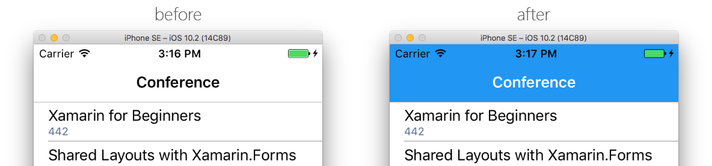
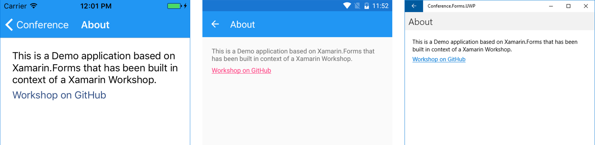

# Platform Specifics
Xamarin and especially Xamarin.Forms are cross-platform frameworks that you mostly target multiple platforms with. Of course, these platforms do still have their specific behaviours and characteristics, that you also want to support. This chapter is about how to achieve that.

## 1. Platform specific UI properties
First thing that comes in mind when talking about platform specifics is often the UI that fundamentally differs between the platforms.

### 1.1 Platform specific properties in XAML and code-behind
When creating a shared UI with Xamarin.Forms, we might come to a point, where we want to adjust specific properties of these UIs regarding to the platform it runs on. Typical platform adjustments can be

- Margin and Padding
- Colors
- Layouting and Positioning
- Font size

Xamarin.Forms brings an easy way to give an UI element's properties different values regarding to the platform it is running on: The `OnPlatform` tag.

```xml
<OnPlatform
    x:TypeArguments="<TYPE>"
    Android="<ANDROID_SPECIFIC_VALUE>"
    WinPhone="<WINDOWS_SPECIFIC_VALUE>"
    iOS="<IOS_SPECIFIC_VALUE>" />
```

In XAML, we can use this tag to define platform specific values for each property. For example, instead of defining the `Margin` of a button like this

```xml
<Button Name="TestButton" Text="Click Me!" Margin="20" />
```

you can use the `OnPlatform` tag to do it for each platform.

```xml
<Button Name="TestButton" Text="Click Me!">
    <Button.Margin>
        <OnPlatform
            x:TypeArguments="Thickness"
            Android="14"
            WinPhone="20"
            iOS="20" />
    </Button.Margin
</Button>
```

This pattern can be used for every property of every UI element in Xamarin.Forms. You can also call this in code-behind by using the `Device.OnPlatform` method, to declare platform specifics there.

```csharp
Device.OnPlatform(iOS: () => TestButton.Margin = new Thickness(14));
```

### 1.2 Platform specific styling
Beside the XAML UI in Xamarin.Forms, you can also always access the platform projects directly and modify the UI there. Remember, that everything we define in XAML will be rendered to **native** UI elements for the platforms.

As you might have noticed, the Android app does have a blue navigation bar by default, while the iOS one's is grey. Xamarin.Forms does not support navigation bar colors by now, but we can still define colors for the `UINavigationBar` the traditional way.



To do so, let's modify the `AppDelegate.cs` file inside the `Conference.Forms.iOS` project.

```csharp
[Register("AppDelegate")]
public partial class AppDelegate : global::Xamarin.Forms.Platform.iOS.FormsApplicationDelegate
{
    public override bool FinishedLaunching(UIApplication app, NSDictionary options)
    {
        // Set Navigation Bar Color for iOS
        UINavigationBar.Appearance.BarTintColor = UIColor.FromRGB(33, 150, 243);
        UINavigationBar.Appearance.TintColor = UIColor.White;
        UINavigationBar.Appearance.TitleTextAttributes = new UIStringAttributes() { ForegroundColor = UIColor.White };

        // ...        
    }
}
```
## 2. Custom Renderers
Actually, everything that Xamarin.Forms does when creating native controls out of the XAML definition is using one of its [Renderer Base Classes](https://developer.xamarin.com/guides/xamarin-forms/custom-renderer/renderers/). These renderers turn XAML into native controls on each platform and they can be extended.

Creating custom renderers always follows the same steps

1. Create a renderer class inside the platform project(s)
1. Derive from [Renderer Base Class](https://developer.xamarin.com/guides/xamarin-forms/custom-renderer/renderers/)
1. Override the `OnElementChanged` method
1. Expose the renderer to the Xamarin.Forms framework using `ExportRenderer`

Most renderer classes expose the `OnElementChanged` method, which is called when a Xamarin.Forms custom control is created in order to render the corresponding native control. Custom renderer classes, in each platform-specific renderer class, then override this method in order to instantiate and customize the native control. However, in some circumstances the `OnElementChanged` method can be called multiple times, and so care must be taken when instantiating a new native control in order to prevent memory leaks.

```csharp
protected override void OnElementChanged (ElementChangedEventArgs<NativeListView> e)
{
    base.OnElementChanged (e);

    if (Control == null) {
        // Instantiate the native control
    }

    if (e.OldElement != null) {
        // Unsubscribe from event handlers and cleanup any resources
    }

    if (e.NewElement != null) {
        // Configure the control and subscribe to event handlers
    }
}
```

### 2.2 Extend existing renderers
With custom renderers we can change the look and behaviour of controls and views that Xamarin.Forms brings out of the box. For example, we could change the way Xamarin.Forms renders images on iOS and extend the default `ImageRenderer` by a functionality that draws images in circles by default.

#### 2.2.1 Create a Custom Image Renderer
For this, add a new class `CustomImageRenderer` to the `Conference.Forms.iOS` project and let it derive from `ImageRenderer`, which is the renderer that is used by Xamarin when using images according to [this list](https://developer.xamarin.com/guides/xamarin-forms/custom-renderer/renderers/).

Now we can override the `OnElementChanged` method, call `base.OnElementChanged(e);` method to call the default behaviour and extend it by the `CornerRadius`, which is used by iOS to create round images.

```csharp
public class CustomImageRenderer : ImageRenderer
{
    protected override void OnElementChanged(ElementChangedEventArgs<Xamarin.Forms.Image> e)
    {
        base.OnElementChanged(e);

        if (Control != null)
        {
            // Add corner radius to UIImage control
            Control.Layer.CornerRadius = Control.Image.Size.Width / 2;
            Control.ClipsToBounds = true;
        }
    }
}
```

#### 2.2.1 Expose it to the framework
Once we did this, the last thing we have to do is telling the Xamarin.Forms framework, that this is the new renderer to use, when it comes to an `Image`. This can be achieved by declaring the `ExportRenderer(Type FormsControl, Type Renderer)` assembly attribute to the namespace.

```csharp
[assembly: ExportRenderer(typeof(Xamarin.Forms.Image), typeof(CustomImageRenderer))]
namespace Conference.Forms.iOS
{
    public class CustomImageRenderer : ImageRenderer
    {
        // ...
```

After rebuilding the iOS application now and navigation to the `SpeakerDetailsPage`, we can see that the image on iOS is rendered differently from the images on Android and Windows, because we implemented a custom renderer for controls of type `Xamarin.Forms.Image` iOS.


### 2.3 Renderers for new controls
If you take a look at the official list of iOS, Android and Windows controls, you will find only a small subset of these covered by Xamarin.Forms. This is simply because Xamarin.Forms needs implement the controls on all mobile platforms while abstracting the same functionality for each platform in the shared code.

What is currently missing in Xamarin.Forms is a Hyperlink Button with basically is a clickable text. So let's go ahead and extend our project with such a button!

#### 2.3.1 Create a new abstract control
To introduce a completely new control to Xamarin.Forms, we have to describe it inside the shared *Conference.Forms* project first. For this, we simply add a new class `HyperlinkLabel` that derives from Xamarin.Forms' original `Label` control and offers an additional bindable property for the `Uri`.

Some of the logic can be done in the shared code like setting the text color and reacting on touch events. But as Xamarin.Forms does not support underlining by default currently, we need to do this in custom renderers for our `HyperlinkLabel` control.

```csharp
namespace Conference.Forms.CustomControls
{
    public class HyperlinkLabel : Label
    {
        public static readonly BindableProperty UriProperty = BindableProperty.Create(nameof(Uri), typeof(string), typeof(HyperlinkLabel), null);
        public string Uri
        {
            get { return (string)GetValue(UriProperty); }
            set { SetValue(UriProperty, value); }
        }

        public HyperlinkLabel()
        {
            // Set text color
            TextColor = Color.Accent;

            // Underlining is set by custom renderers
            // On Android and UWP only, as it is against the iOS design guidelines

            // Add interaction
            var tapGestureRecognizer = new TapGestureRecognizer();
            tapGestureRecognizer.Tapped += delegate
            { 
                if (Uri != null)
                { 
                    Device.OpenUri(new Uri(Uri)); 
                }
            };
            GestureRecognizers.Add(tapGestureRecognizer);
        }
    }
}
```

#### 2.3.2 Add the custom control to the UI
To use the new control in XAML, simply add its namespace to the root element and add the element with the `namepsace:element` syntax. It has all `Label` properties plus the `Uri` property we added.

```xml
<ContentPage 
    // ...
    xmlns:custom="clr-namespace:Pollenalarm.Frontend.Forms.CustomRenderers">

    <custom:HyperlinkLabel                    
        Text="Xamarin Workshop"
        Uri="https://github.com/robinmanuelthiel/xamarinworkshop" />
</ContentPage>
```

#### 2.3.3 Implement the Custom Renderers for each platform
Now it's time to create platform specific renderers for the `Hyperlinklabel` control to add the underlining. So let's add a `HyperlinkLabelRenderer` class to the platform projects and expose it to the framework by declaring the `ExportRenderer` assembly, right as we saw it before.

This time, instead of exporting the renderer for an already existing Xamarin.Forms control, we export it for the `HyperlinkLabel` we created by ourselves.

```csharp
[assembly: ExportRenderer(typeof(HyperlinkLabel), typeof(HyperlinkLabelRenderer))]
```

**iOS implementation**

Underlining hyperlinks is against Apple's design guidelines, so we won't do this on the iOS platform. As this is the only thing, we are doing in our custom renderer at the moment, we can omit it.

**Android implementation**
```csharp
[assembly: ExportRenderer(typeof(HyperlinkLabel), typeof(HyperlinkLabelRenderer))]
namespace Conference.Forms.Droid.CustomRenderers
{
    public class HyperlinkLabelRenderer : LabelRenderer
    {
        protected override void OnElementChanged(ElementChangedEventArgs<Label> e)
        {
            base.OnElementChanged(e);

            if (e.NewElement != null)
            {
                // Set TextView underlining
                Control.PaintFlags |= Android.Graphics.PaintFlags.UnderlineText;
            }
        }
    }
}
```

**UWP implementation**
```csharp
[assembly: ExportRenderer(typeof(HyperlinkLabel), typeof(HyperlinkLabelRenderer))]
namespace Conference.Forms.UWP.CustomRenderers
{
    class HyperlinkLabelRenderer : LabelRenderer
    {
        protected override void OnElementChanged(ElementChangedEventArgs<Label> e)
        {
            base.OnElementChanged(e);

            if (e.NewElement != null)
            {
                // Set TextView underlining
                var underlinedText = new Underline();
                underlinedText.Inlines.Add(new Run { Text = Control.Text });
                Control.Text = string.Empty;
                Control.Inlines.Add(underlinedText);
            }
        }
    }
}
```

We can use the new control to create a link to this workshop for example. For this, why don't we add an *About* page with some information and add it the app's toolbar? Should be an easy task now, if you need some guidance, take a look at the [finished code](/Code).



## 3. Platform specific functionality
Beside UI elements, you will can also define platform specific behaviours in your business logic. There might be scenarios, where you want to use features, that are only available on specific platforms, like *Widgets on Android* or *Live Tiles on Windows*. These things can't be covered in shared logic, of course.

Additionally, there are many things that simply get handled differently on the platforms. Access to the local storage for example is something that every platform can do, but the native APIs for that differ dramatically. Xamarin.Forms does already cover some basic behaviours and offer abstractions for that like displaying alerts with the `DisplayAlert`. Although the Xamarin community also offers a lot of [Community Provided Open Source Plugins](https://github.com/xamarin/XamarinComponents), you sometimes come to the point where you want to create your very own implementation of a specific behaviour on platform level.

Let's take the **Text-To-Speech** functionality as an example. Text-To-Speech is something, that every platform offers, but there is no Xamarin.Forms implementation for it that abstracts the logic for us. So let's create our own platform specific implementations for that!

### 3.1 Create an interface
First, we need to define an abstraction of the logic we want to provide on the shared code level. Similar to the last time, create an `ITextToSpeech` interface inside the shared **Conference.Frontend** project and define a single `Speak(string)` method that every implementation of the interface has to define.

```csharp
public interface ITextToSpeech
{
    void Speak(string text);
}
```

### 3.2 Implement the interface on platform level
The logic for the `Speak` method uses the platform's speech APIs of iOS, Android and UWP and has to be implemented inside the according projects. Here we create a new class like that implements the `ITextToSpeech` interface and uses the platform's APIs there.

Similar to custom renderers, the class has to register a `Xamarin.Forms.Dependency` assembly to tell the framework that this a dependency that resolves the `ITextToSpeech` interface.

```csharp
[assembly: Xamarin.Forms.Dependency (typeof (YourPlatformImplClass))]
```

> **Hint:** As we implemented the `ITextToSpeech` interface inside the **Conference.Frontend** project, make sure that the platform projects **Conference.Forms.iOS**, **Conference.Forms.Droid** and **Conference.Forms.UWP** all reference this project to get access to the interface.

**iOS implementation**
```csharp
[assembly: Xamarin.Forms.Dependency(typeof(TextToSpeechiOS))]
namespace Conference.Forms.iOS
{
    public class TextToSpeechiOS : ITextToSpeech
    {
        public void Speak(string text)
        {
            var speechSynthesizer = new AVSpeechSynthesizer();
            var speechUtterance = new AVSpeechUtterance(text);
            speechSynthesizer.SpeakUtterance(speechUtterance);
        }
    }
}
```

**Android implementation**
```csharp
[assembly: Xamarin.Forms.Dependency(typeof(TextToSpeechAndroid))]
namespace Conference.Forms.Droid
{
    public class TextToSpeechAndroid : Java.Lang.Object, ITextToSpeech, TextToSpeech.IOnInitListener
    {
        TextToSpeech speaker;
        string toSpeak;

        public void Speak(string text)
        {
            toSpeak = text;
            speaker = new TextToSpeech(Xamarin.Forms.Forms.Context, this);
        }

        public void OnInit(OperationResult status)
        {
            if (status.Equals(OperationResult.Success))
                speaker.Speak(toSpeak, QueueMode.Flush, null, null);
        }
    }
}
```

**UWP implementation**
```csharp
[assembly: Xamarin.Forms.Dependency(typeof(TextToSpeechUWP))]
namespace Conference.Forms.UWP
{
    public class TextToSpeechUWP : ITextToSpeech
    {
        public async void Speak(string text)
        {
            MediaElement mediaElement = new MediaElement();
            var synth = new Windows.Media.SpeechSynthesis.SpeechSynthesizer();
            SpeechSynthesisStream stream = await synth.SynthesizeTextToStreamAsync(text);
            mediaElement.SetSource(stream, stream.ContentType);
            mediaElement.Play();
        }
    }
}
```

### 3.3 Call the implementaion in shared code
Now that every platform has its own implementation of the `ITextToSpeech` interface, we can call these implementations in the shared code. For this, we use the [`DependencyService`](https://developer.xamarin.com/guides/xamarin-forms/dependency-service/) class, that comes with Xamarin.Forms and is able to locate implementations of interfaces in the platform projects, after they have been registered through the `Xamarin.Forms.Dependency` assembly.

Let's add the Speech-To-Text feature to our `SessionDetailsPage.xaml.cs` and let it speak out the session title, whenever the user navigates to it! To perform actions, when the user navigates to a page, we can override the `OnAppearing()` method.

```csharp
protected override void OnAppearing()
{
    // ...
}
```

Here we can try to get the platform specific implementation of `ITextToSpeech` by calling the `DependencyService.Get<Type>()` method. If we found an implementation, we can call its `Speak(string)` method to let the app read the text.

```csharp
protected override void OnAppearing()
{
    var textToSpeechImpl = DependencyService.Get<ITextToSpeech>();
    if (textToSpeechImpl != null)
    {
        textToSpeechImpl.Speak(viewModel.CurrentSession.Name);
    }
}
```

This pattern enables us to use platform specific logic in shared frontend code, by simply abstracting functionality in interfaces that get implemented inside the platform projects.